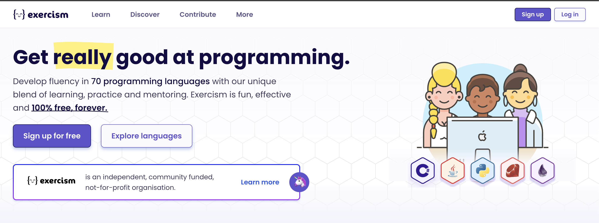

# Exercim

You can find the exercises on [exercism.io](https://exercism.io/my/tracks) I find it very useful to learn new languages because you can compare them with other languages you know.

## How to run the program

### C#
`dotnet run filename`

### Swift

`swift filename`

### Bash

`./filename.sh`

### C

`gcc filename.c -o filename`

`./filename`or I use `make`` to compile and run the program

### Ruby

`ruby filename.rb`

### Java

### No gradle or maven 
`javac filename.java`
`java filename`

#### With gradle or maven

#### Gradle
`gradle run` or `gradle test`

#### Maven
todo

### Javascript

`node filename.js`

### Typescript

`ts-node filename.ts`
or
`tsc filename.ts && node filename.js`

### Lisp

`clisp filename.lisp`
or
`ros run filename.lisp`

### Lua 

`lua filename.lua`

### Haskell
Haskell has the GHC (Glasgow Haskell Compiler) to compile and run the program
`ghc filename.hs`
`./filename`

HelloWorld.hi - The interface file.
HelloWorld.o - The object file.
HelloWorld (or HelloWorld.exe on Windows) - The executable, if a main function were defined.

### OCaml

`ocaml filename.ml`

### Nim

`nim c filename.nim`
`./filename`

### Php

`php filename.php`

### Python

`python3 filename.py`

### Sqlite

`sqlite3 -bail < filename.sql`

### WASM
`wasmtime filename.wasm`

### Zig
`zig run filename.zig`

### CPP 
`g++ filename.cpp -o filename`
`./filename`